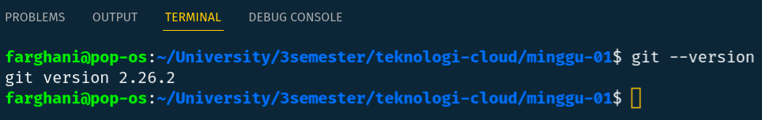
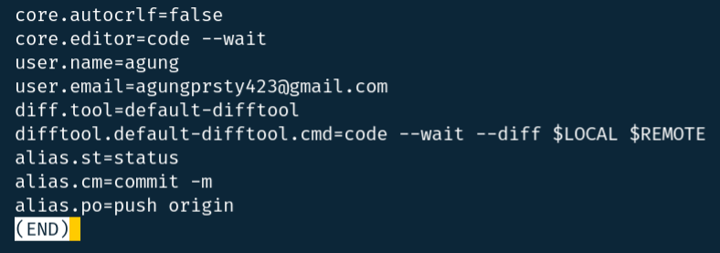
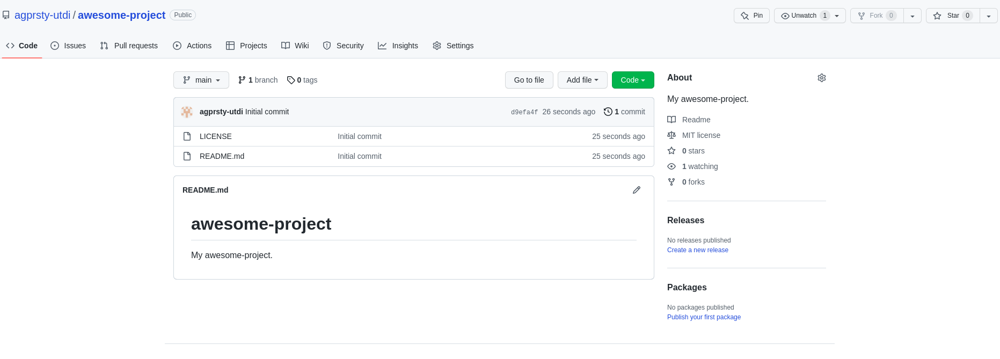
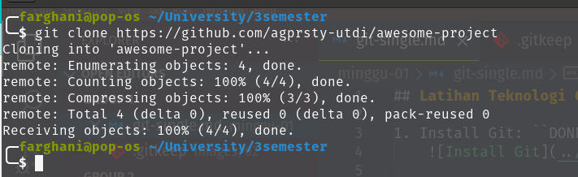
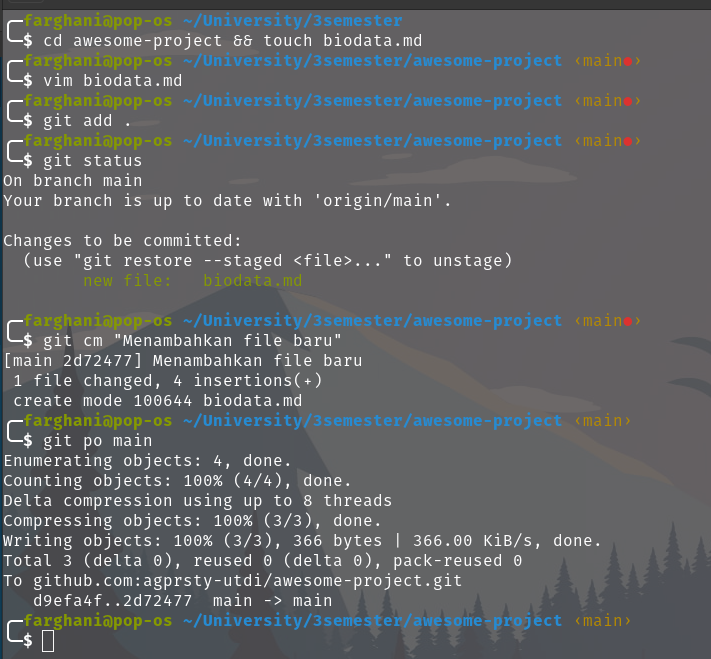
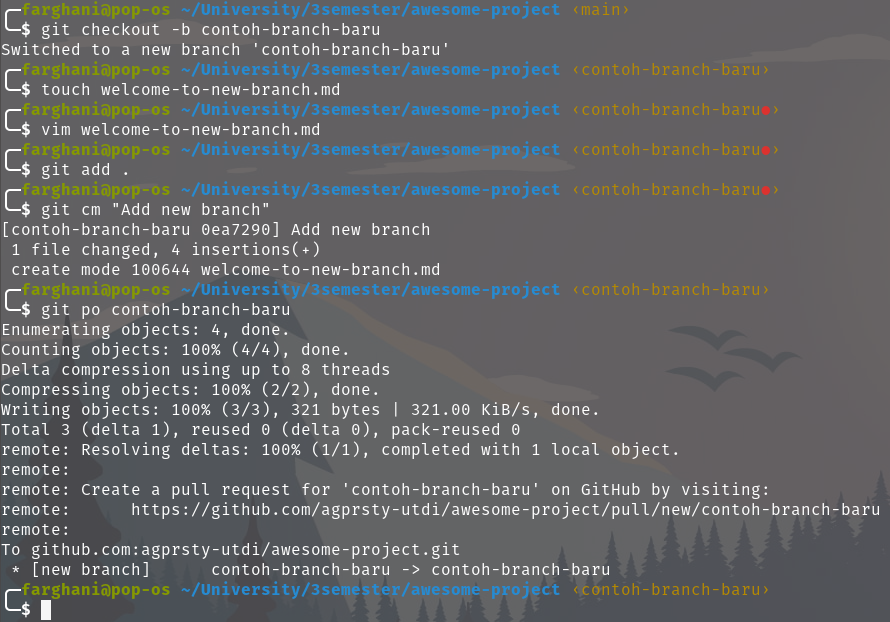
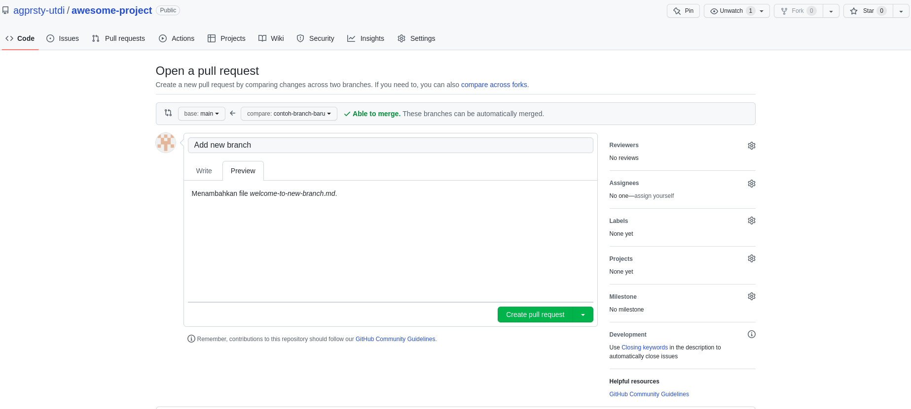
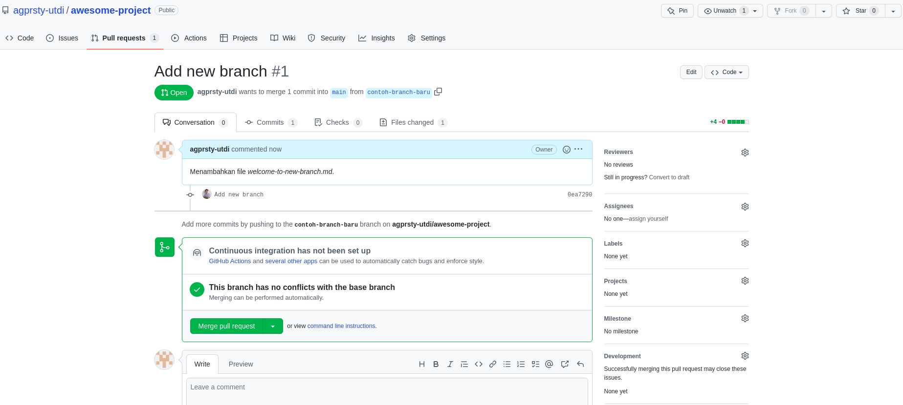
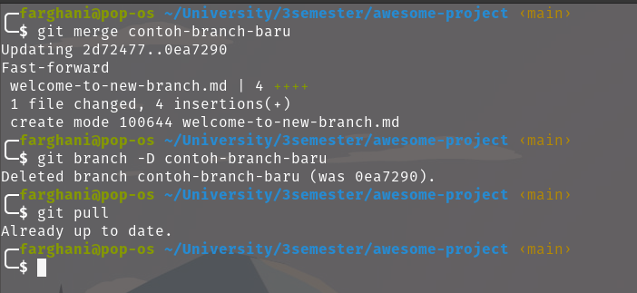
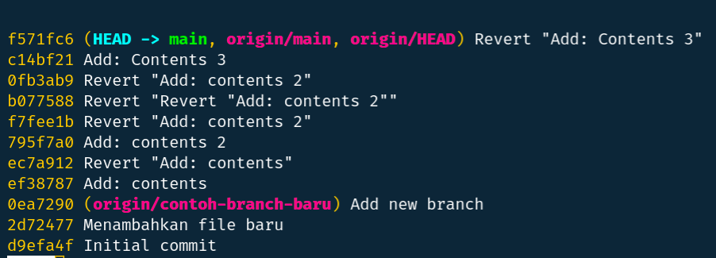

## Latihan - Minggu 01

1. Install Git: ``DONE``
    

2. Konfigurasi Git: ``DONE``
    

3. Kelola Repo: ``DONE``
    - Membuat Repo Baru
    
    
    - Clone Repo
    

    - Menambahkan File
    

    - Menambahkan Branch
    

    - Mengubah/Menambahkan Isi dengan Branching and Merging
    
    
    

    - Undo Commit Terakhir
    