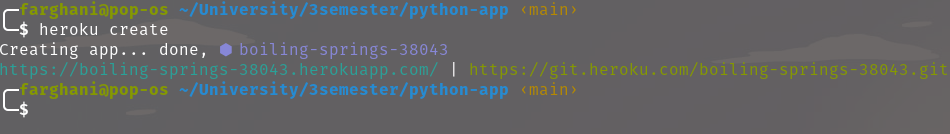
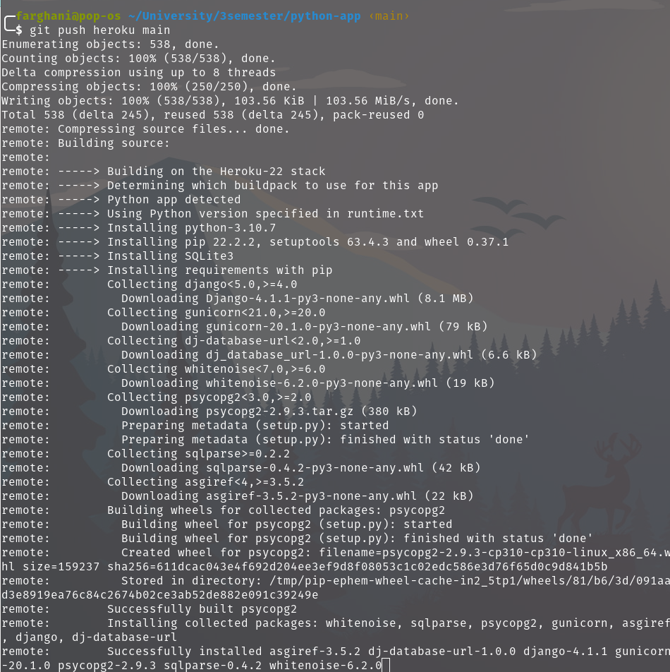
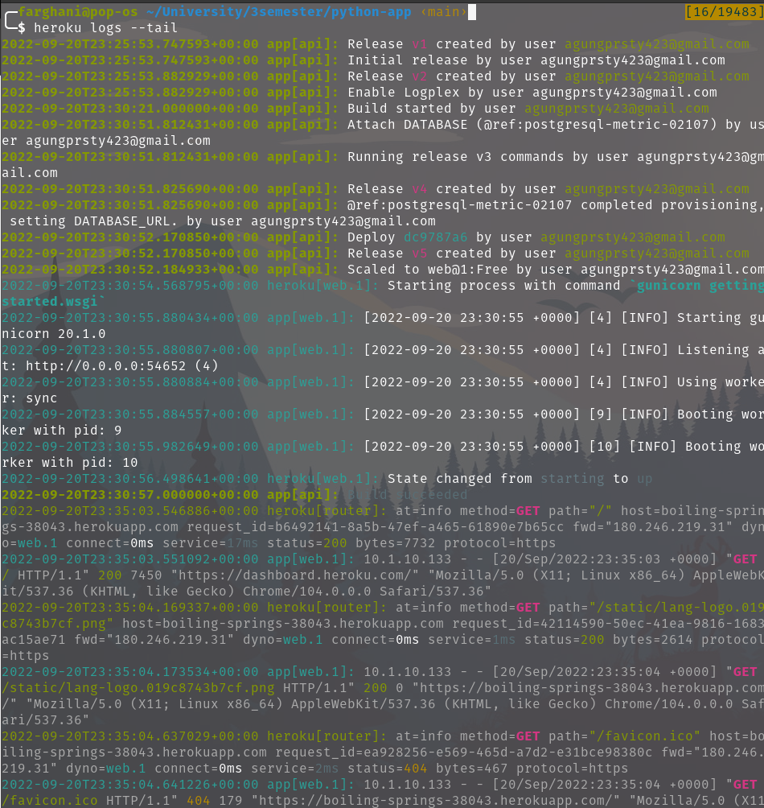
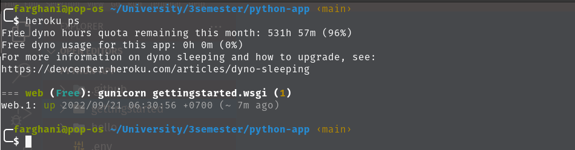
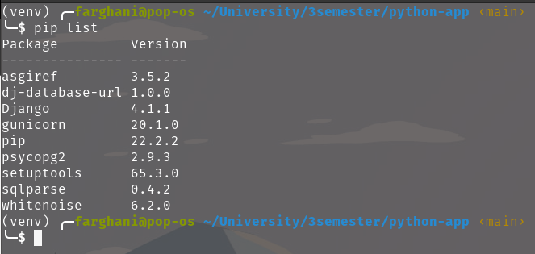

## Getting Started on Heroku with Python

### heroku create

### heroku push heroku main

### heroku logs --tail

### heroku ps

### pip list

### link website
[python-app](https://boiling-springs-38043.herokuapp.com/)