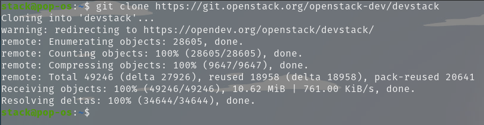
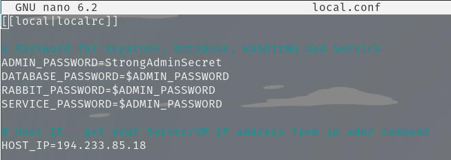
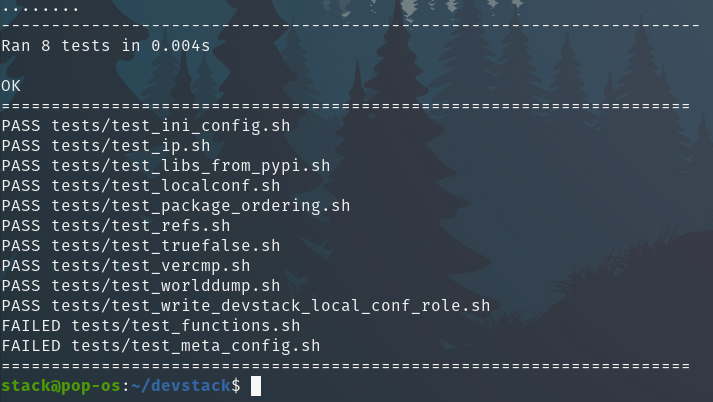
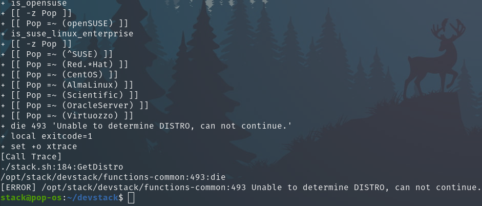

## Install Openstack


### Install Dev Stack



### Set local.conf



### Test Run



### Error Not Compatible



```
Mohon maaf sebelumnya pak, saya belum berhasil menjalankan **./stack.sh** karena distro tidak compatible dengan openstack.
```