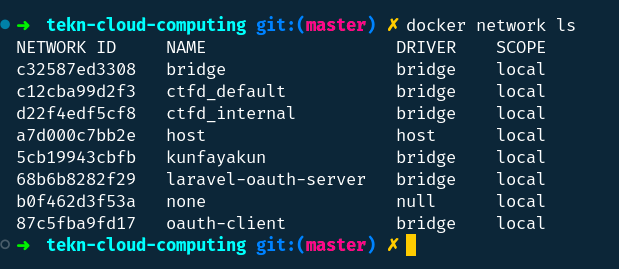

## Bridge Networking

### Step 1: The Basics

### Step 2: Connect a container

``Create a new container by running docker run -dt ubuntu sleep infinity.``

``You can verify our example container is up by running docker ps.``

### Step 3: Test network connectivity

``Lets run a shell inside that ubuntu container, by running docker exec -it <CONTAINER ID> /bin/bash.``

``Ping github``

### Step 4: Configure NAT for external connectivity

``Start a new container based off the official NGINX image by running docker run --name web1 -d -p 8088:80 nginx.``

``You can connect from your Docker host using the curl 127.0.0.1:8088 command.``

