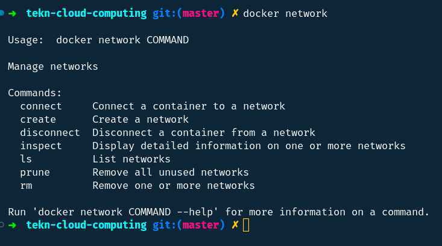
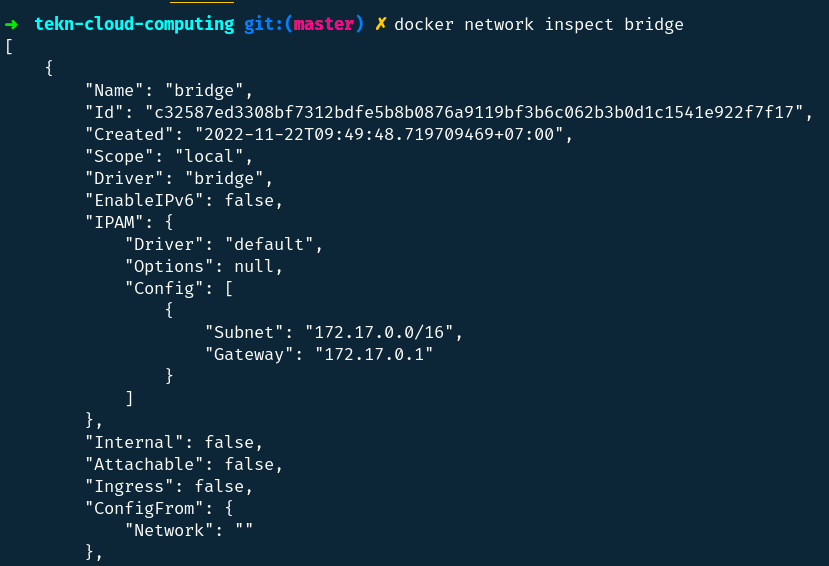
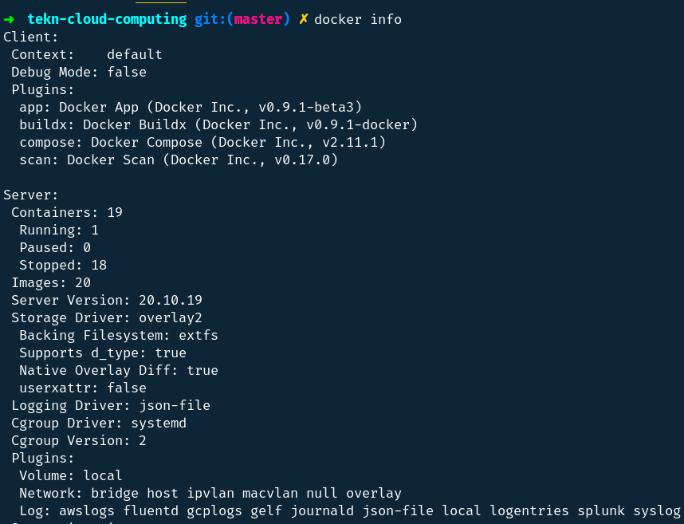

## Networking Basics

### Step 1: The Docker Network Command



```
docker network merupakan perintah utama untuk mengkonfigurasi dan mengelola network.
```

### Step 2: List networks


```
docker network ls merupakan perintah untuk melihat jaringan kontainer yang ada di host Docker saat ini.
```


### Step 3: Inspect a network



```
docker network inspect merupakan perintah untuk melihat detail konfigurasi network.
```

### Step 4: List network driver plugins




```
docker info merupakan perintah yang menunjukkan banyak informasi menarik tentang instalasi Docker.
```