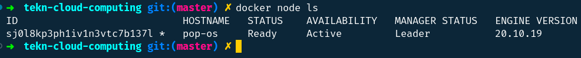
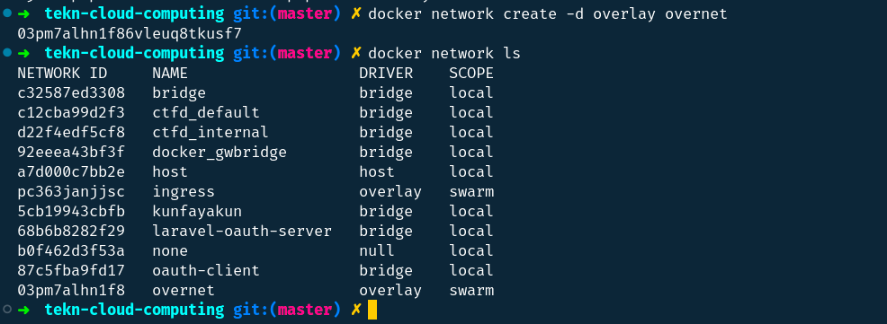
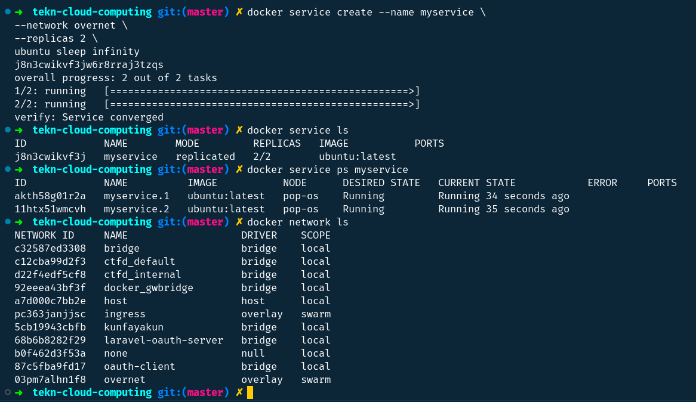
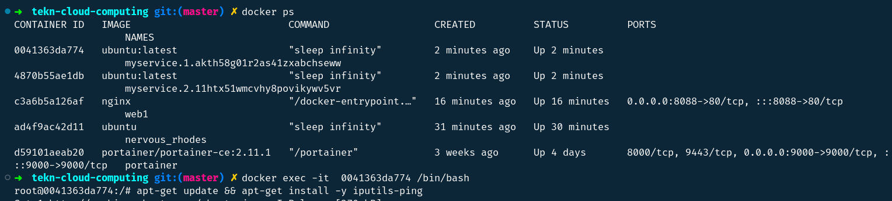
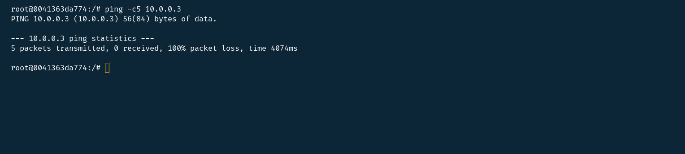

## Overlay Networking

### Step 1: The Basics

``Run a docker node ls to verify that both nodes are part of the Swarm.``

### Step 2: Create an overlay network

``Create a new overlay network called “overnet” by running docker network create -d overlay overnet.``

### Step 3: Create a service

``Now that we have a Swarm initialized and an overlay network, it’s time to create a service that uses the network.``

### Step 4: Test the network

